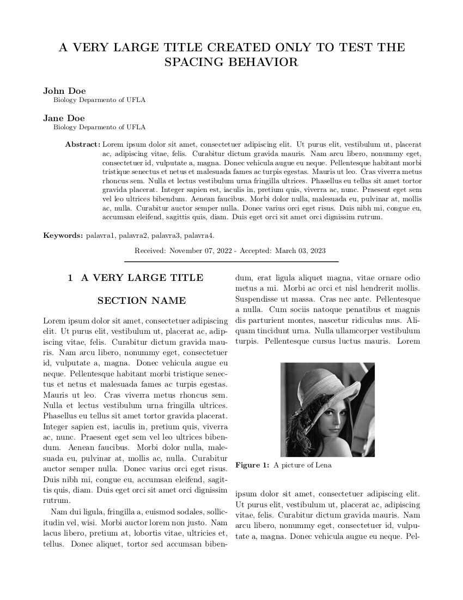

# Latex class to TAE journal

Creates macros in the TAE journal format.

## Load the class
Put the `tae-ufla-article.cls` file in some location, by example `/path/of/file`.
To load the class use the next command in the preamble of main tex document.

	\documentclass{/path/of/file/tae-ufla-article}

